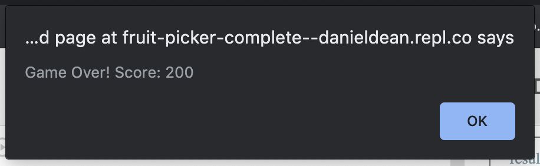
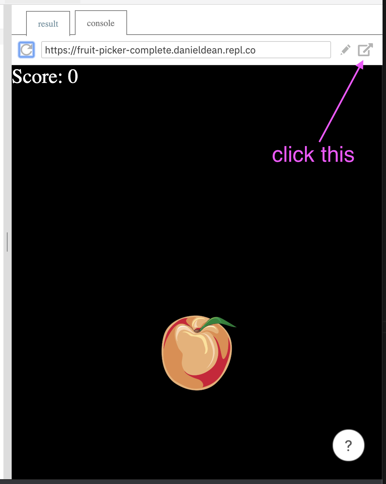

# Fruit Picker: A Basic HTML, CSS, and JavaScript Game

We are going to use HTML, CSS, and JavaScript to build a simple game called fruit picker. We are choosing these because they are easy to run. If the program is correct it can run in any browser, including on phones.

Here is what the final product will be:

<iframe src="https://fruit-picker-complete.danieldean.repl.co/" width="500" height="300"></iframe>

## Getting the template

If you visit this URL: https://repl.it/@DanielDean/fruit-picker-template you should be able to click a button called "fork" ans create your own copy. This has all the html and css you need! You will only need to write JavaScript. However we'll do a walkthrough of the HTML and CSS before writing anything.

**the html**
The html file is the first file that is loaded. It loads other files. Open `index.html` and take a look at the contents:

```
<!DOCTYPE html>
<html>
  <head>
    <meta charset="utf-8">
    <meta name="viewport" content="width=device-width">
    <title>Fruit Picker</title>
    <link href="style.css" rel="stylesheet" type="text/css" />
  </head>
  <body>
    <script src="script.js"></script>
    <div id="background"></div>
    <div id="scoreDisplay"></div>
    
  </body>
</html>
```

There are some things in here which would be boring to explain, so I'll skip them for now! Here are the things you should be aware of:

```
    <link href="style.css" rel="stylesheet" type="text/css" />
```

and

```
    <script src="script.js"></script>
```

load the other files in your project. You should see `script.js` and `styles.css` in the "Files" section.

```
    <div id="background"></div>
    <div id="scoreDisplay"></div>
    
```

These are going to be visible elements. The `id` is how we can reference them. Can you guess what each one is going to be?

**the css**

`styles.css` is another file we should take a look at. This mostly defines how things should look.

```
#background {
  position: absolute;
  top: 0px;
  left: 0px;
  bottom: 0px;
  right: 0px;
  background-color: black;
}
#apple {
  width: 100px;
  height: 100px;
  position: absolute;
}
#scoreDisplay {
  position: absolute;
  top: 0px;
  left: 0px;
  pointer-events: none;
  color: white;
  padding: 5;
  font-size: 20pt;
}
```

You can play around with these values a little if you like. For instance you can pick a different `background-color` than `black`. here is a full list of colors you can try: https://www.w3schools.com/colors/colors_hex.asp

**script.js**

This should be empty! We will fix that in a little bit.

## Adding an Apple

The nice thing about html is that you can point to any image that is on the internet, and it should work. For instance I picked this image from wikimedia:


The url is `https://upload.wikimedia.org/wikipedia/commons/7/73/Apple_clipart.png`

You can search on google for your own!

In order to add the apple, you need to update the `img` in the `index.html` file:

```

```

Hopefully you can copy and paste the url, so you only have to type `src=""`!

## Randomize the Apple Position

So the apple is in a nice location up there, but wouldn't it be great if it was different every time the page loaded?

In order to do this, we need to learn two concepts: `onload` and `Math.random()`.

**onload**

`onload` is an event, in other words "a thing that happens". You can wire up `onload` to call a function of your choice in the `script.js` file. Lets add 2 functions to `script.js` to get started:

```
function startGame() {
  updateApplePosition();
}

function updateApplePosition() {
}
```

`startGame()` is the function that will get called when we start the game. It calls `updateApplePosition()`, which does nothing at the moment. In order to call this function in `onload`, we need to update the html again. Update the first `body` element so that it looks like this:

```
  <body onload="startGame()" >
```

Don't add it to the end body tag!

```
  <!-- NOT GOOD! -->
  </body onload="startGame()" >
```

Now we are ready to change the apples position inside `updateApplePosition()`.

**position the apple**

To start let's use some constants to assign our fruit positions. I am going to use `left = 50` and `top = 100`. Feel free to pick new numbers if you want!

Additionally I have comment lines that start with `// ...` below. Feel free to skip typing those.

```
// this is a comment, you can skip typing this in your code!
function updateApplePosition() {
  // set constant numbers to start
  var left = 50;
  var top = 100;
  // get the apple by using the "id" that is in the "id" field
  // ie: "

So we actually want to make sure that the full height and width of the apple are always onscreen. If the screen is 1000 pixels wide, and the apple is 100 pixels wide, then we want to multiply `Math.random()` against `(1000 - 100)`. In our css, we defined the apple to have a width and height of 100:

```
#apple {
  width: 100px;
  height: 100px;
  position: absolute;
}
```

So we can just use those numbers explicitly:

```
  var left = Math.random() * (window.innerWidth - 100);
  var top = Math.random() * (window.innerHeight - 100);
```

Now the apple should update every time you reload! Here's what I have for script.js so far:

```
function startGame() {
  updateApplePosition();
}

function updateApplePosition() {
  var left = Math.random() * (window.innerWidth - 100);
  var top = Math.random() * (window.innerHeight - 100);
  var apple = document.getElementById("apple");
  apple.style.left = "" + left + "px";
  apple.style.top = "" + top + "px";
}
```

# Pick the fruit

When we say "pick" we really mean click with a mouse or tap with a finger. Handling this is pretty easy. Here's the function to add to script.js:

```
  function onAppleClick() {
    updateApplePosition();
  }
```

Additionally, you need to add `onclick` to the `img` in `index.html`:

```
    
```

This tells the `img` to call `onAppleClick()` every time it is clicked or tapped!

You should be able to click on the apple now! Every time you click, its position will change. Try it out!

## Adding a Score

So this is pretty fun, but we want to see a score for each time we pick the fruit. First at the top of `scripts.js`, add a score:

```
var score = 0;

// this should already be here!
function startGame() {
```

When we were updating `var left`, `var right`, and `var apple`, those were meant to only be used inside `updateApplePosition()`. `var score` could be used by every function, and should keep its value. For that reason, we add it to the top of the file, outside of the functions.

Additionally, we will want to update and display the score. Let's add a function to do that. Again, you can skip the `// ...` comment lines.

```
// updateScore accepts a parameter "newScore"
function updateScore(newScore) {
  // assign newScore to be the score
  score = newScore;
  // get the "div" with the "scoreDisplay" id and set it to show the current score:
  document.getElementById("scoreDisplay").innerText = "Score: "+score;
}
```

Now that we can update the score with this function, lets use it in 2 places. `startGame()` should update the score to `0`:

```
function startGame() {
  updateApplePosition();
  updateScore(0);
}
```

`onAppleClick()` should update the score to whatever the current score is plus `100`:

```
function onAppleClick() {
    updateApplePosition();
    updateScore(score + 100);
}
```

## Game Over

Now let's add some stakes! What if you miss? The game should be over then. We need to capture that press.

First lets make a function for when the background is pressed:

```
function onBGClick() {
  // show an alert with the final score
  alert("Game Over! Score: " + score);
  // start a new game after the alert is dismissed
  startGame();
}
```

And then add that to the background element:

```
    <div id="background" onclick="onBGClick()"></div>
```

The `alert(..)` function shows a system dialog that looks like this on my computer:



It's not terribly pretty! But it gets the job done. After you click "Okay", a new game starts.

## All Done

That's it! You can pop the game into its own window using this button:



This opens the game in a dedicated page that you can share with your friends and family! Be proud of the work you've done so far!
