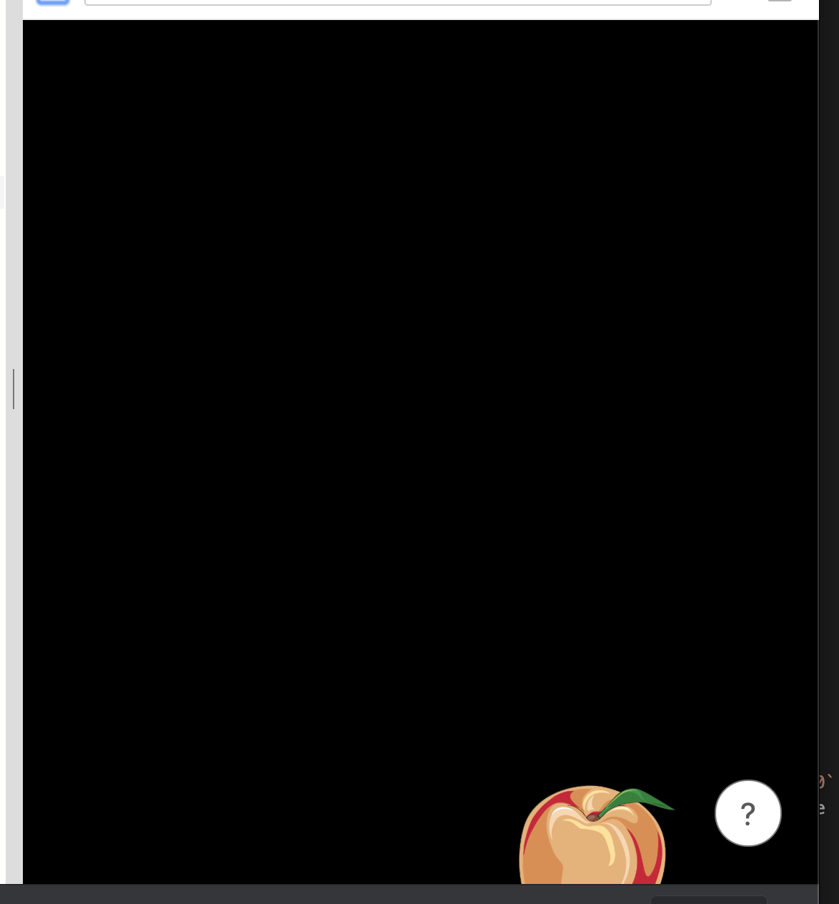

# Make a Simple Game in React Native

This tutorial will guide you through building Shoot the Fruit in React Native.

## Setting up a Clean Slate

Because it is a very simple game, you should be able to build it all on https://snack.expo.io/. However it is recommended you make an account with the website so that your progress is saved.

---

**important note #1**
If you don't create an account than don't reload the browser! You might lose your work.

---

If you visit the website, you should be able to get a snack running pretty quickly that looks like this:


Since this is a tutorial for beginners, we will make it as simple as possible and delete some items from the default template. Delete "assets" and "components" from the side bar under "Project".


Select "App.js" under projects so you can edit it. Carefully delete lines until it looks like this:

```
import * as React from 'react';
import { Text, View, StyleSheet } from 'react-native';

export default class App extends React.Component {
  render() {
    return (
      <View style={styles.container}>
      </View>
    );
  }
}

const styles = StyleSheet.create({
  container: {
  },
});
```

---

**important note #2** if you've made games in scratch or pygames, you will be used to the idea of creating a sprite, and adding it to the screen. Once the sprite is on the screen, you can tell it to move, change appearance, or disappear. In react native, there is a `render()` method, and that is called every time the window needs to update. Everything about what is on the screen needs to be described in that method, and returned. This is a different way of doing things, so you may need to adjust to it.

---

Your project pane should look like this:


This is a good starting point to start adding code

## Setting Up Some Sizes

First, we need to know how big the screen is. We can do that by importing "Dimensions" at the top. Additionally, I will add comment lines that start with a `//`. Don't bother retyping the comment lines, unless you REALLY want to.

```
// DONT RETYPE THESE COMMENT LINES
// Do add Dimensions here -------v
import { Text, View, StyleSheet, Dimensions } from 'react-native';
```

And then we can get the width and height of the window by adding these lines after the imports:

```
const WIDTH = Dimensions.get('window').width;
const HEIGHT = Dimensions.get('window').height;
```

With these sizes we can set the size of the "container" on the bottom. You may notice that I added lines with `//` in the front of them. These are comments, and you should skip retyping them if it makes things easier on you!

```
const styles = StyleSheet.create({
  container: {
    // 'absolute' means this is going to be position
    position: 'absolute',
    // we want the container to be lined up with the top left of the window
    // and take up the full width and height
    top:0,
    left: 0,
    width: WIDTH,
    height: HEIGHT,
    // I set it to black, but feel free to experiment with other colors!
    // full color list is here: https://www.w3schools.com/colors/colors_hex.asp
    backgroundColor: 'black',
  },
});
```

---

**important note #3** the `styles` object is a way of permanently describing appearances. There is actually a small bug in this! (I won't spoil it for you.) But we will fix that later in the tutorial.

---

Now you should have a project view that looks like this:


## Adding an Apple

So you should find an image of an apple for yourself. Here's the one I picked from wikimedia commons:


So the tricky part is that you need to save that to your computer. Then, you need to drag it from your downloads folder (wherever that is) onto your expo project webpage. It should show up under Projects when you are done. I renamed the first part of my file name to "apple" so it was easier to type and remember. Don't change the last part! "jpg", or "gif", or "jpg" should stay the same.

Next, we need another import to display the image. Add `, Image` after `Dimensions`:

```
import { Text, View, StyleSheet, Dimensions, Image } from 'react-native';
```

Now we can show the apple image in the container. Update the `render()` method so it looks like this:

```
render() {
    // tell the image how big to be, similar to how we told the container how big to be.
    const style = {
        width: 100,
        height: 100
    };
    // Get the image using "require"
    // 'apple.jpg' should match whatever name you picked for your image under projects.
    return (
        <View style={styles.container}>
            <Image style={style} source={require('apple.jpg')} />
        </View>
    );
}
```

`'apple.jpg'` should match whatever name you picked for your image under projects.

Here's what my project looks like at this point:


## Randomize the Apple Position

So the apple is in a nice location up there, but wouldn't it be great if it was different every time the page loaded?

In order to do this, we need to learn two concepts: react state and `Math.random()`.

**Math.random()**

`Math.random()` is a simple function that is very commonly used in javascript. If you call it, it will return a value from zero up to, but not including, 1. So you could call `Math.random()` and get 0. You could also call `Math.random()` and get 0.9999999. But you won't get 1.

**react state**

The best way to track values that can change in react native is to put them into react state. Let's add a state with some random values for the left and top position.

```
// this line should already be in App.js
export default class App extends React.Component {
  // add these lines here
  state = {
    topScale: Math.random(),
    leftScale: Math.random()
  };
```

**position the apple**

Okay, so now we have some random values in our state. Let's use them to position our apple. Let's start with something simple:

```
render() {
    // add these lines
    const left = WIDTH * this.state.leftScale;
    const top = HEIGHT * this.state.topScale;
```

There are some things going on here, so I will explain each of them. Above we assigned a value to state using `state = {...` Now that we are inside a function, we need to access that value using `this.state`. However if we were inside a function and tried to write `state = {...` that wouldn't work! It only works inside of `...class App...{` but outside of a function.

Next, we are accessing the `this.state.leftScale`. In the lines above we set that to be a value from 0-1. However in order to change the position, we need to take the width of the window into account, so we multiply them. For example if `this.state.leftScale` equals `0.25` and `WIDTH` equals `400`, then `left` will equal `100`. Every time we reload the app, that value should change, and we will get new `top` and `left`!

Now we can add these values to the `style` object:

```
    const style = {
        // add the next two lines
        left: left,
        top: top,
        // these lines should already be there
        width: 100,
        height: 100
    };
```

You should be able to pop the game out into its own window by clicking the box with the arrow here:


When the game pops out in its own window, you should be able to reload it a few times and see that the apple changes position each time! Nice work! You may have noticed a small bug with that though. If you reload enough times, the fruit will be hanging off the window:



So actually we need to tweak the lines that are calculating `left` and `top`.

```
    const left = (WIDTH - 100) * this.state.leftScale;
    const top = (HEIGHT - 100) * this.state.topScale;
```

In the lines above we are making sure that the `left` and `top` allow for the whole apple image to be on the screen.

Just to make sure here's what your App.js should probably look like:

```
import * as React from 'react';
import { View, StyleSheet, Image, Dimensions } from 'react-native';

const WIDTH = Dimensions.get('window').width;
const HEIGHT = Dimensions.get('window').height;

export default class App extends React.Component {
    state = {
        topScale: Math.random(),
        leftScale: Math.random()
    };

    render() {
        const left = (WIDTH - 100) * this.state.leftScale;
        const top = (HEIGHT - 100) * this.state.topScale;

        const style = {
            left: left,
            top: top,
            width: 100,
            height: 100
        };
        return (
            <View style={styles.container}>
                <Image style={style} source={require('apple.jpg')} />
            </View>
        );
    }
}

const styles = StyleSheet.create({
  container: {
    position: 'absolute',
    top:0,
    left: 0,
    width: WIDTH,
    height: HEIGHT,
    backgroundColor: '#000000',
  },
});
```

# Shoot that fruit!

When we say "shoot" we really mean click with a mouse or tap with a finger. Handling this is pretty easy, BUT requires a new function. Here's how it looks:

```
    };

    // Add onAppleClick

    _onAppleClick = () => {
        this.setState({
            topScale: Math.random(),
            leftScale: Math.random()
        });
    }

    render() {
```

Here's a few explanations:

```
_onAppleClick = () => {
```

This indicates that we are making a new function that can handle clicks.

```
this.setState({
```

This means we are setting a new value for state! Outside this function we were able to set the initial value like this `state = {...` but inside this function we need to do `this.setState({`. Remember to use `setState`, not `this.state = {`.

```
topScale: Math.random(),
leftScale: Math.random()
```

These are brand new values for our top and left!

In order to use `_onAppleClick`, we need to import a new component:

```
// add TouchableOpacity ----------------------------v
import { Text, View, StyleSheet, Dimensions, Image, TouchableOpacity } from 'react-native';
```

And we need to add it to the render method, so lets update it like this:

```
render() {
    const left = (WIDTH - 100) * this.state.leftScale;
    const top = (HEIGHT - 100) * this.state.topScale;

    // rename style to touchableStyle
    const touchableStyle = {
        left: left,
        top: top,
        width: 100,
        height: 100
    };

    // add a new style called imageStyle
    const imageStyle = {
        width: 100,
        height: 100
    };

    // nest the Image inside the TouchableOpacity like this:
    return (
        <View style={styles.container}>
            <TouchableOpacity style={touchableStyle} onPress={this._onAppleClick}>
                <Image style={imageStyle} source={require('apple.jpg')} />
            </TouchableOpacity>
        </View>
    );
}
```

We assign the `touchableStyle` with the top and left to the outer `TouchableOpacity`, and assign `imageStyle` with just a width and a height to the inner `Image`.

You should be able to click around now! Try it out for reference, here's my version:

```
import * as React from 'react';
import { Text, View, StyleSheet, Image, Dimensions, TouchableOpacity } from 'react-native';

const WIDTH = Dimensions.get('window').width;
const HEIGHT = Dimensions.get('window').height;

export default class App extends React.Component {
    state = {
        topScale: Math.random(),
        leftScale: Math.random()
    };

    _onAppleClick = () => {
        this.setState({
            topScale: Math.random(),
            leftScale: Math.random()
        });
    }

    render() {
        const left = (WIDTH - 100) * this.state.leftScale;
        const top = (HEIGHT - 100) * this.state.topScale;

        const touchableStyle = {
            left: left,
            top: top,
            width: 100,
            height: 100
        };

        const imageStyle = {
            width: 100,
            height: 100
        };

        return (
            <View style={styles.container}>
                <TouchableOpacity style={touchableStyle} onPress={this._onAppleClick}>
                    <Image style={imageStyle} source={require('apple.jpg')} />
                </TouchableOpacity>
            </View>
        );
    }
}

const styles = StyleSheet.create({
  container: {
    // this means that the styles will say how big this box should be
    // otherwise the container would grow and shrink with the stuff inside
    position: 'absolute',
    top:0,
    left: 0,
    width: WIDTH,
    height: HEIGHT,
    backgroundColor: '#000000',
  },
});
```

## Adding a Score

So this is pretty fun so far! But we want to see a score for each time we shoot that fruit. Let's start by adding an initial value of zero:

```
    state = {
        topScale: Math.random(),
        leftScale: Math.random(),
        ///
        score: 0
    };
```

Next we need to be able to show it, so we should add Text to the imports if it isn't already there:

```
// I've had it here all along :) Add it if you don't see it!
// ------v
import { Text, View, StyleSheet, Dimensions, Image, TouchableOpacity } from 'react-native';
```

Then we can add another style to our `styles`:

```
const styles = StyleSheet.create({
  container: {
    position: 'absolute',
    top:0,
    left: 0,
    width: WIDTH,
    height: HEIGHT,
    backgroundColor: '#000000',
  },
  // add scoreText
  scoreText: {
    fontSize: 14,
    fontWeight: 'bold',
    height: 25,
  },
});
```

Now we can use the elements we've added, and combine them in the render method:

```
// Add `text` above the TouchableOpacity
return (
    <View style={styles.container}>
        <Text style={styles.scoreText}>Score: {this.state.score}</Text>
        <TouchableOpacity style={touchableStyle} onPress={this._onAppleClick}>
            <Image style={imageStyle} source={require('apple.jpg')} />
        </TouchableOpacity>
    </View>
);
```
