# Units of Meaning #2 : Pantsers vs Plotters

I shared my first piece on [Units of Meaning](/units_of_meaning_1.md) with friends and family, and got some feedback. One note that stuck out to me was that my writing needed "more of a story to it". This was great news, because I want to write about the relationship between the shaping narrative and how we construct its meaning.

## Stephen King on Plot

When I was younger, I was given "On Writing" by Stephen King. It is an autobiography, explanation of his writing process, and a chronicle of his journey as an author. At the time, something that jumped out at me was his stance against plotting. Here is a related quote I found in an article he wrote in [The Guardian](https://www.theguardian.com/books/2000/oct/01/stephenking.sciencefictionfantasyandhorror):

> I distrust plot for two reasons: first, because our lives are largely plotless, even when you add in all our reasonable precautions and careful planning; and second, because I believe plotting and the spontaneity of real creation aren't compatible.

In my first piece, I was entirely driven by "the plot", ie, the definitions, descriptions, theories, and assumptions that I wanted to comunicate. I completey ignored any sense of narrative or story telling. I attempted to make sure that the ideas started simple, and scaled up in complexity, but I didn't work to build a thread. I was writing like a plotter.

## Game of Thrones and Plotters vs Pantsers

The Game of Thrones TV show had a big finale to the series and it received mixed reviews from the audience. The first 4-5 seasons were well received, but the last were less well received. An analysis that was repeated in several places was that the character decisions didn't seem to make sense. If some [online thinkpieces](https://www.wired.com/story/game-of-thrones-plotters-vs-pantsers/) are to be believed, this is because the show runners were writing seasons 5-8 as plotters would, but they adapted seasons 1-4 from source material that was written by a pantser.

George R.R. Martin is firmly in Stephen Kings camp with regard to plot. To him, the plot isn't as important as growing the characters and setting naturally. The term he uses is a "gardener" as opposed to an "architect". A made up term for this is "Pantser" meaning "by the seat of his pants."

In contrast, the last 4 seasons of the tv show were being written by different people, who wanted certain story beats and certain climactic set pieces to occur. The made up term for writing in service of an outline such as those is being a "Plotter."

## Writing Concepts and Reading Concepts

There are two processes I'd like to talk about with regard to writing a narrative. The journey of the writer, and the journey of the reader. Each goes through the process of building concepts. However the writer builds concepts in their mind and writes them to words. The reader reads words in order to rebuild those concepts. Another quote from Stephen King regarding writing that relates to this:

> Description begins in the writer’s imagination, but should finish in the reader’s.

Plotters and pantsers have different patterns for building concepts and different approaches for setting those concepts to page. This results in very different experiences for the reader. The reader builds the concepts linearly without knowing the end ahead of time.

Note that I use the term "write" and "read" but these same patterns hold for novels, tv shows, movies, and story driven video games.

## The Concepts of a Plotter

**The Journey of the Writer**

For a plotter, there is typically some really cool sequence or finale they are working toward. Here it is, as represented in their mind before writing to page:

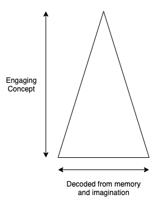

In the journey of the writer, the writer didn't have to read a book to build that concept. They made it up in their head. They don't have to put decoding work into rebuilding that concept when they revisit it. As they become familiar with the memory of it, it takes less and less work to reconstruct it in their mind.

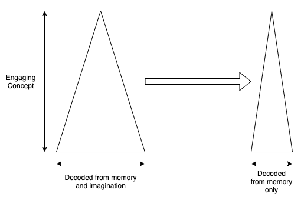

However, the concept stays just as deep as it was in the mind of the writer, so the writer is getting more and more positive feedback on that concept. As the work goes down, and the positive feedback stays the same, the writer gets more and more convinced that this is a good idea for a story. This is an example of a "wicked learning environment" where the feedback you are getting is reinforcing the wrong lessons.

So now a plotter sets down to write. In order to have a story, everything needs to be put in place for the climax. Therefore the plotter is always asking this question:

> What is the next concept that I can add that will get me closer to my next setpiece/plot point?

The plotter then sets about trying answer that question. In other words they are trying to build this:

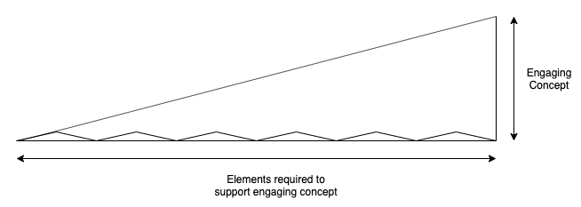

The depth or comprehension of the individual concepts is not as important as those concepts being puzzle pieces that are part of the overall whole.

**The Journey of the Reader**

But what happens in the mind of the reader? This is their moment to moment of experience reading the text:

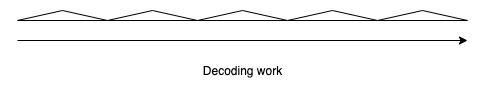

The reader has no idea that there is a big finale. They are putting decoding effort into creating each concept along the way, however those concepts aren't individually deep. They are rewarded for the hard work at the end with a setpiece/climax/twist, etc. The reader had to execute a large volume of decoding effort in order to build the same concept as the writer. Here is the comparison of their effort for generating that same concept:

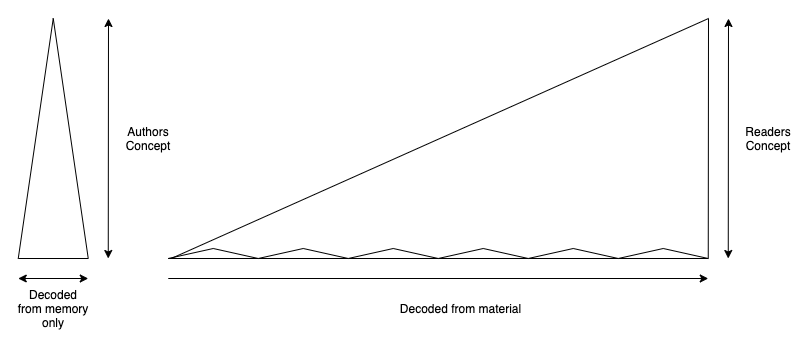

In order to satisfy a reader the narrative needs to be sufficiently satisfying to justify all the work. The longer a book gets, the less likely this will be true. People would rather do less work to build the same concept.

## The Concepts of a Pantser

Pantsers very frequently start with setting, situation, or group of characters which they find interesting. They may generally know where the story is going, but they aren't too invested in the specifics of how they get there. This is similar to what a plotter does at first with the plot. The real difference comes to when they write. The pantser is asking this question:

> What is the next most interesting thing I can do with my characters/setting/situation?

The pantser then sets about trying to build a concept that best draws out the interesting traits of the character/setting/setpiece. In other words they are attempting to do this:

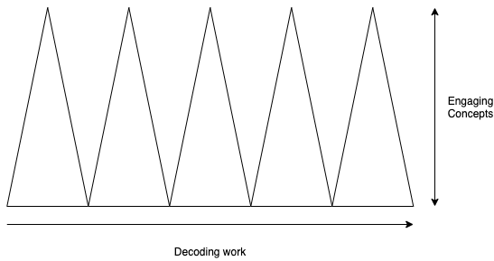

But what happens in the mind of the reader? Their reading experience ends up being similar:

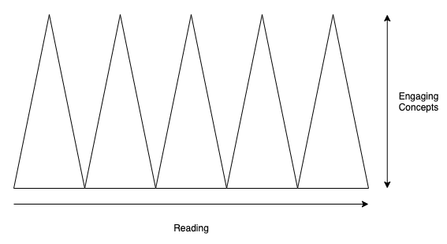

The reader is propelled by the fact that moment to moment, interesting things are happening, and that the things that happened before are making the next thing more interesting.

The problem is that many readers crave a narrative. The human mind is always looking for a causal story to assemble from the world (whether there should be one or not). Pantsers can frequently get to the end of a story but without an overall payoff. Here is where you can compare the work of a pantser vs a plotter:

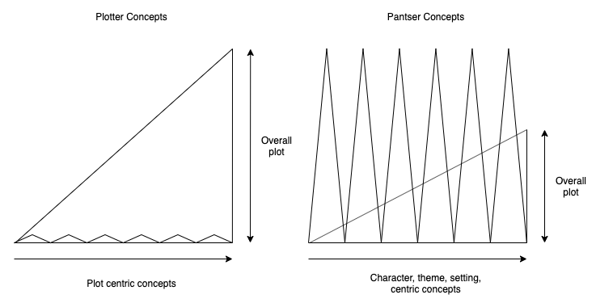

[One criticism](https://www.goodreads.com/topic/show/796662-king---can-he-write-decent-endings) of Stephen King is that he can have a hard time writing endings.

This can also explains why George R. R. Martin does unexpected with characters. His primary purpose isn't to build an overall narrative, its to make sure that he is creating the next most interesting thing that serves the setting, situation, or that character.

## It's difficult to do both

Let's imagine a writer named Bob. Bob doesn't know anything so he sits down and writes a story without asking either of the questions that Plotters and Pantsers ask above. He literally writes the first idea that enters his head. He ends up with a story like this:

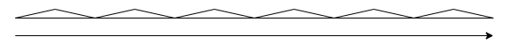

He tries to get this story published, but can't because it has no narrative, and no depth. He gets feedback from his friends and family and they say "it needs more plot". He does a little research and decides to try a plot driven story. This time he writes asking the plotters question: "What is the next concept that I can add that will get me closer to my next setpiece/plot point?". However, now that he is using this filter, he can't write the first idea that enters his head. In fact let's assign an arbitrary number to this: he finds he needs to generate 5 times as many ideas in order to find one that fits. So now it takes 5 times as long as the first book and he ends up with this:

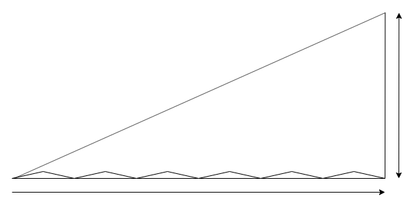

He tries to get this story published, and lets say he succeeds. Maybe its a moderate success. However, the reviews are mixed, and Bob knows that his work isn't great. He does some more research and decides that he wants to try his hand at being a pantser. He puts in a lot of effort to forget his plotter habits, and starts with settings, characters and themes. He then writes with this question in mind: "What is the next most interesting thing I can do with my characters/setting/situation?" However he now finds he needs to generate 10 times as many ideas to satisfactorily answer that question. The book takes two times longer than the previous one to write, and he isn't able to write a very good ending, it just sort of ends. This is what he is able to make:

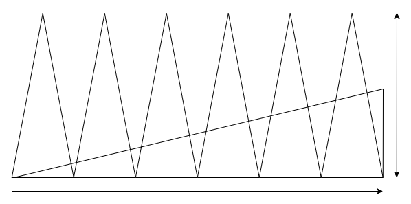

The fans of his first book are a little confused about the change of style, but it actually turns out to be a bigger success than the first one. Bob still isn't satisfied though, and thinks he can write a book that answers something close to both questions. He wants to write a book with a concept graph closer to this:

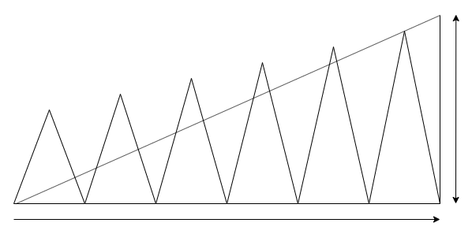

He does some thinking and attempts to write a book with both these questions in mind

> What is the next most interesting thing I can do that brings these elements closer to conflict?
>
> What is the most interesting way that I can resolve that conflict?

Now Bob is in trouble. Let's say each question requires 5 times as much time investment to properly answer. That means to find an idea that satisfies both it might take 25 times as long to satisfy both questions. After spending some time with this approach, and not making much headway, he realizes how much longer its going to be until he finishes the book. Maybe he has set an internal deadline, OR he might not be motivated enough to spend that much time on the story. If it took 3 months to write his first terrible book, 15 months to write his second plotter moderate success, and 30 months to write his pantser book, this one will be 75 months, or over 6 years. He looks back and thinks "I'd rather just publish SOMETHING." So he returns to whichever method he prefers (plotter or pantser) and keeps on writing that way for the rest of his career.

## How Long Until The Winds of Winter

Game of Thrones fans ask "why is the Winds of Winter taking so long" and my theory is that Martin is trying to write a book by answering both questions, and therefore struggles to generate the 25x ideas (or whatever number it is) in order to answer those questions satisfactorily. In the beginning of the series he could focus entirely on the first question, without much worry about the second one. Now that he is much closer to the conclusion, he HAS to answer both, or disappoint his fans with a weak narrative.

He does have an option to get it out earlier. He _could_ just be more like Bob, and pick one question or the other. Given how he started the series he could just write the next most interesting thing without worrying about whether it concludes the narrative or not. This would probably make the fans crazy, but at least they would have a book.

## My Writing

I am still pretty close to the beginning of my journey like Bob at the beginning of his. I wrote this piece asking "what is the next most interesting thing I could say related to this subject." I covered a good portion of what I wanted to, and I think its an improvement in readability in comparison to my first article. On the other hand I had planned a section on the writing quality of "flow" and how it relates to the pantser style of writing. The problem was that the pantser style of writing didn't naturally take me there. If I want to say everything I want to say, I may need to work like a plotter. If I want to emphasize readability, I may need to work like a panster. But I don't see myself trying both without being practical about how long it will take.
