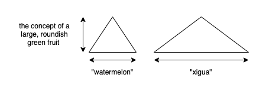
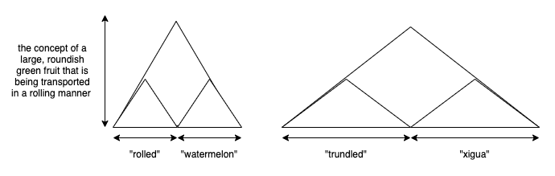
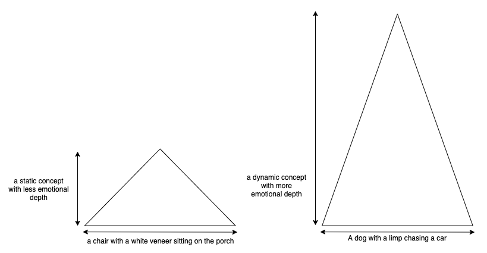

# Units of Meaning #1 : The Effort of Constructing Concepts

## A Simple Example

Visualize the idea represented by this word:

**dog**

What did you think about? Did you see a dog in your mind? Was it doing anything in particular? Whatever you did, you momentarily built a concept in your mind around that word. Let's try visualizing a different word:

**running**

What did you think about then? Did you think about the general idea of moving fast on legs? Did you imagine a person running, or was it the dog from the previous example? Let's explicitly join the two concepts now:

**a running dog**

So now we've created a new concept from the other two. "dog" and "running" individually had some ambiguity to them. The dog could be doing anything (for me its at rest, sitting). The word running could be applied to anything (I only visualized human legs running, not a particular person or even gender). By combining them we are reducing the ambiguity. The dog is doing doing a particular action, and running is applied to a particular subject. "a running dog" is a distinct, discrete concept from the two concepts that were used to create it.

## Conceptual Combination

The simple example above is meant to demonstrate conceptual combination. From the [wikipedia entry](https://en.wikipedia.org/wiki/Conceptual_combination):

> Conceptual combination is a fundamental cognitive process by which two or more existing basic concepts are mentally synthesized to generate a composite, higher-order concept.

In the example we took basic concepts "dog" and "running" and built a higher-order concept: "a running dog". The process is mostly automatic and is normally something we do without thinking. You are doing it right now by reading this sentence. And this one. And this one.

We built a simple higher order concept, one that most people who have any familiarity with dogs should have been able to create with little effort. However we could have constructed stranger combinations such as "pineapple juggling" and "floating couch". We could have also used less common words such as "trundled xigua". If you attempted to visualize each of them, you likely had to put more effort into it in comparison to "a running dog". It is specifically the types effort of conceptual combination that I am going to discuss.

## Defining Effort

Above we mentioned a "trundled xigua". This is a fancy way of saying "rolled watermelon". To use this in a sentence: "The farmer rolled the watermelon in a cart." or "The farmer trundled the xigua in a cart." Let's focus on the effort of xigua vs watermelon. For me, watermelon is a pretty common word. I grew up eating watermelon. Nowadays our family buys a few every summer, and our children make a mess out of eating them. Xigua on the other hand is only familiar to me because its the x in an alphabet book I read to my kids. When I first came across it I was completely unfamiliar with it. Given that it is less common, let's assume that the effort of reading "xigua" is higher than the effort of reading "watermelon". However you do need to put effort into both words to read them. This is what I'll call **decoding effort**.

In "trundled xigua" and "rolled watermelon" my intended purpose for both phrases is to create the concept of a roundish fruit with green and yellow skin that is being moved in a rolling manner. For both phrases the actual concept is about the same. Using a different example, "pineapple juggling" should be realively easy to decode. However it might take a little more effort to think about. You may not have ever seen a person juggling pineapples (or a pineapple with arms, juggling balls) so it took a little effort to imagine this. The effort to construct a concept in your mind is what I'll call **comprehension effort**.

## Decoding vs Comprehension

Let's take our example above and plot the efforts with an arbitrary scale like this:

The volume of the triangle represents the amount of work required for comprehension. The width of the triangle represents the decoding effort, and the height of the triangle represents the comprehension effort. The graphic above shows that in order to build the same concept, people are putting in more work when the word xigua is used, and less when the word watermelon is used. Furthermore, for different words, they are building effectively the same concept. The comprehension effort is approximately the same.

The example above is only working with a single concept, so let's expand this example to include the verbs. Let's assume that the effort of decoding "trundle" is more than the effort of decoding "roll":

The figure above represents the work of conceptual combination. In one case, two difficult to decode words have been used, but are combined to a relatively simple concept. In the other case, simpler words have been used to build the same concept. However the overall effort for the combined concept has significantly decreased. Suppose instead of just two words we scaled it up to a full sentence: "The agriculturalist trundled his xiguas in a descending manner on the declining geological formation covered in monocotyledonous flowering plants of the Poaceae family." vs "The farmer rolled his watermelons down the grassy hill." Both are meant to build the same concept, but the latter sentence is much easier to decode. If I was reading a book that was entirely composed of very hard to decode sentences that represent pretty simple concepts, I would probably give up and spend my time elsewhere.

## Adding Conceptual Depth

Before we are done, I want to add one more dimension. In the above example I represented the differences in decoding effort. Let's explore an example that represents the differences in comprehension effort. Visualize this sentence:

**a chair with a white veneer sitting on the porch**

And now visualize this one:

**A dog with a limp chasing a car**

If you are like me, the second sentence likely triggered a stronger emotional reaction than the first. The two sentences have approximately the same decoding difficulty. The words are all relatively common, and sentence structure is straightforward. However concepts they represent are significantly different. In one, you have inanimate objects in a static context. Nothing is happening. In the second sentence, you have an animal performing an action on a moving object. Furthermore the animal has a property that changes how it is acting. My reaction is an emotional one: that despite a limp, the dog still wants to chase the car. I'd like to plot them as follows, based on my own reactions:

The graphic above is meant to illustrate that for approximately the same level of decoding effort I was able to construct a concept that required a very different level of comprehension effort.

## Assumptions + Theories

I'd like to propose the following points that I intend to fully explore in this series of articles:

1. People would prefer to do less work in order to build a concept. [^1]
2. The depth of any concept is directly related to the comprehension effort.
3. People are seeking depth when they consume media. This may be intellectual or emotional depth.
4. The decoding effort is not a fixed amount and can be reduced with appropriate familiarity with the decoding methods. However it can't be reduced to zero.
5. The level of comprehension effort is impacted by associative memory. Deeper preexisting memories about a concept will trigger greater comprehension effort, and more depth for the overall concept.
6. The amount of work required to understand a concept can be different based on medium or content. Furthermore, people have a maximum amount of work they can expend on building a concept, and everyone has a max that is different. However the same thing happens for most people when encountering a concept whose work is larger than their max. They either give up, or they get the concept wrong.

## How it can be Applied

This model[^2] can be applied to some interesting domains that I'd like to write more about in the future. Let's briefly look at a few:

_Writing Qualities_

This model lends itself to a better understanding of how qualities like specificity, flow, and unity work in the mind of the reader. I put together an outline of some writing qualities [here](writing_qualities.md), and I'd like to dive into a few of them.

_Mobile vs Desktop_

There has been a marked shift of usage from desktop to mobile. I'd like to explore one of the possible reasons why. The comprehension effort of a mobile interface is almost always lower than the same for a desktop interface. Take a website, for instance any article from wikipedia.org. You can roughly estimate the number of concepts to decode by counting the number of words on the page. In an interface to interface comparison, a user needs to decode and understand more concepts on a desktop interface than on a mobile interface.

_Social Media_

For the longest time I wondered why Snapchat was popular. Teens liking disappearing messages didn't feel like enough of an explanation to me. There had to be something more interesting going on. I feel this model explains part of the reason why snapchats method of consumption is popular. I'd like to apply this model to Snapchat, Twitter, and a few others in some future aricles. (Disclosure, I work for Facebook, so I'll avoid discussing products owned by Facebook for simplicity. There is plenty to talk about in the other products.)

_Books_

Books have a lot of interesting mechanics going on, and it was actually my exploration into building a better reader that made me start thinking about this.[^3]

## Notes

[^1] A book I recently read that reminded me of this was [Thinking, Fast and Slow](https://www.amazon.com/Thinking-Fast-Slow-Daniel-Kahneman/dp/0374533555). It specifically mentioned the more rational part of the brain (which is called System 2 in the book) as being lazy. The intuitive part of the brain (System 1) tries to do as much of the work as it can for System 2.

[^2]: This is an imperfect model, and it will probably need to be revised over time. More importantly the purpose of this model isn't to make scientific predictions that can be proven in experiments. The purpose is an easy framework for thinking about how people build meaning. I am reminded of [Feynman diagrams](https://simple.wikipedia.org/wiki/Feynman_diagram) which are a way of organizing the math of particle physics. This model is attempting to do the same job, which is creating an easier to think about abstraction for how people build concepts.

[^3] I've already tried to organize my thinking about this before in [this video](https://www.youtube.com/watch?v=CIwi5Dctvh8) but not through the framework that I am proposing here.
